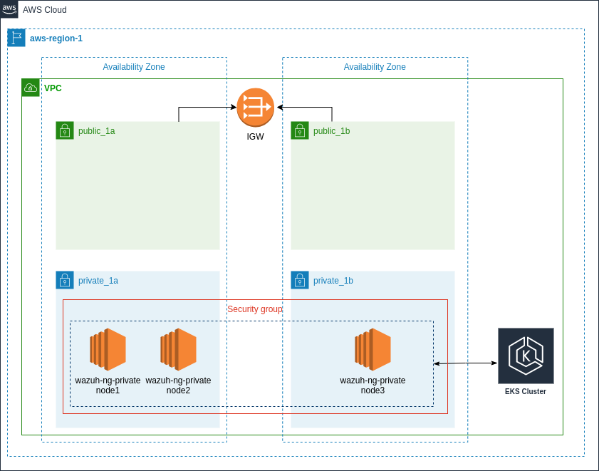

# EKS Cluster Deployment

These instructions describe how we create an EKS cluster to deploy Wazuh. The files and configurations presented here are what we use to test whether Wazuh works as it should in Kubernetes.

Because there are many ways to deploy applications and services on Kubernetes, you can take these instructions as a starting point, and adapt them to your environment.

Here is a diagram of the EKS Cluster deployment:


## AWS Resources

The execution of this guide will create 2 Cloudformation stacks with the following resources:

**Cluster stack**
  - VPC
  - Subnets (public and private)
  - Route Tables
  - IGW
  - NAT Gateway
  - EKS Cluster
  - Security groups

**Nodegroup stack**
  - NodeGroups (EC2 instances)
  - Security groups
  - IAM role

## Pre-requisites

To perform the following steps, you will need to:
- Install `AWS CLI`: https://docs.aws.amazon.com/cli/latest/userguide/getting-started-install.html
- Configure `AWS CLI`: https://docs.aws.amazon.com/cli/latest/userguide/getting-started-quickstart.html
- Install `eksctl`: https://docs.aws.amazon.com/eks/latest/userguide/eksctl.html
- Install `kubectl`: https://kubernetes.io/docs/tasks/tools/#kubectl

## Deployment

To deploy an EKS cluster, you will need to:

1. Define whether you will use an existing VPN.
  a. cluster.yml If you need to create a VPC
  b. cluster_existing_vpc.yml If you already have a VPC
2. Configure the template replacing the values marked with '<>':

    **Common Values**
      - `metadata name`: the EKS cluster name.
      - `metadata region`: the region where the EKS cluster will be deployed.
      - `nodeGroups publicKeyName`: the keyPair for the EC2 instances.

    **Existing VPC Values**
      - `vpc id`: the existing VPC ID.
      - `vpc cidr`: the existing VPC CIDR.
      - `vpc private private-subnet#-az`: the existing private subnet AZ.
      - `vpc private private-subnet#-az id`: the existing private subnet ID.
      - `vpc private private-subnet#-az cidr`: the existing private subnet CIDR.
      - `vpc public public-subnet#-az`: the existing public subnet AZ.
      - `vpc public public-subnet#-az id`: the existing public subnet ID.
      - `vpc public public-subnet#-az cidr`: the existing public subnet CIDR.
3. The deployment requires at least 7 CPU units. We sugest to use 3 `m5a.large` instances. Feel free to change the instance type according to the deployment requirements.
4. Run the following command:

   a. Not existing VPC
    ```BASH
    eksctl create cluster -f cluster.yml
    ```
   b. Existing VPC
    ```BASH
    eksctl create cluster -f cluster_existing_vpc.yml
    ```
5. Wait until the EKS cluster creation finishes.
6. Update `kubeconfig` (replace the values marked with `<>`):
    ```BASH
    aws eks update-kubeconfig --name <eks-cluster-name> --region <eks-cluster-region>
    ```

## License and copyright

WAZUH
Copyright (C) 2022, Wazuh Inc.  (License GPLv2)

## References

* [Wazuh website](http://wazuh.com)
