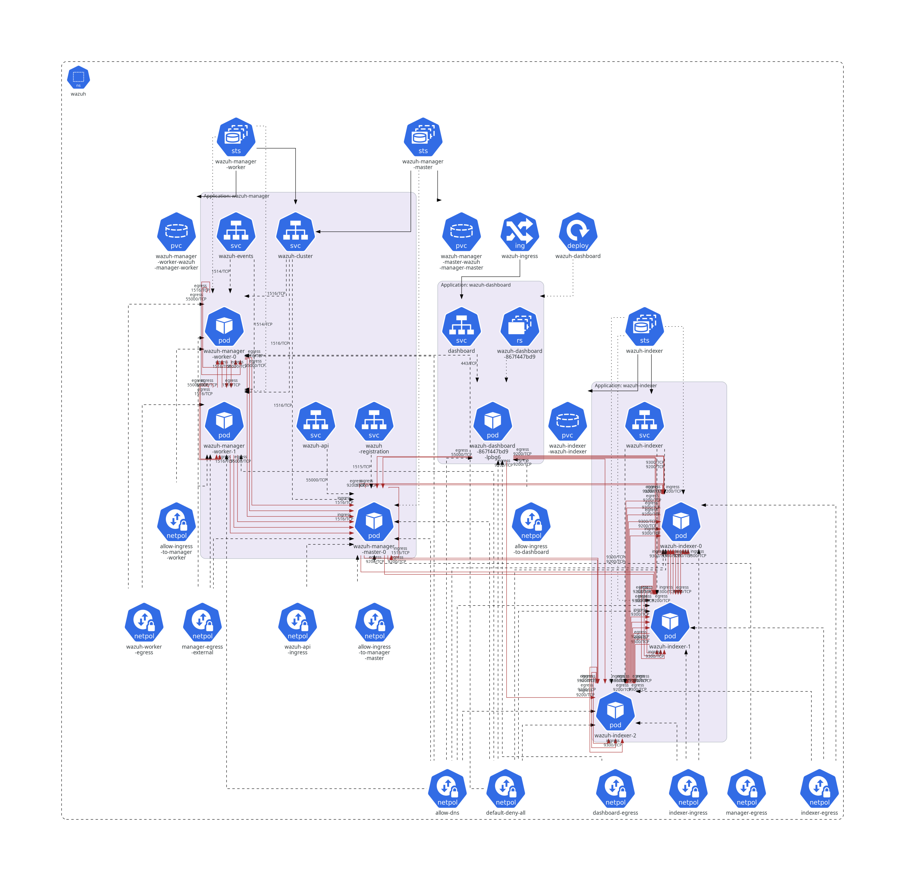

# Introduction

[](https://wazuh.com/community/join-us-on-slack/)
[](https://groups.google.com/forum/#!forum/wazuh)
[](https://documentation.wazuh.com)
[](https://wazuh.com)

# Wazuh Kubernetes Documentation

## Amazon EKS development

To deploy a cluster on Amazon EKS read the instructions on [Usage: AWS EKS Deployment](ref/getting-started/installation.md#eks-deployment).
Note: For Kubernetes version 1.23 or higher, the assignment of an IAM Role is necessary for the CSI driver to function correctly. Within the AWS documentation you can find the instructions for the assignment: https://docs.aws.amazon.com/eks/latest/userguide/ebs-csi.html
The installation of the CSI driver is mandatory for new and old deployments if you are going to use Kubernetes 1.23 for the first time or you need to upgrade the cluster.

## Local development

To deploy a cluster on your local environment (like Minikube, Kind or Microk8s) read the instructions on [Usage: Local Deployment](ref/getting-started/installation.md#local-deployment).

## Diagram



## Directory structure

```bash
├── docs
│   ├── dev
│   │   ├── run-tests.md
│   │   └── setup.md
│   ├── ref
│   │   ├── getting-started
│   │   ├── introduction
│   │   ├── backup-restore.md
│   │   ├── glossary.md
│   │   ├── introduction.md
│   │   ├── performance.md
│   │   ├── uninstall.md
│   │   └── upgrade.md
│   ├── README.md
│   ├── SUMMARY.md
│   ├── book.toml
│   ├── build.sh
│   ├── server.sh
│   └── wazuh-namespace.png
├── envs
│   ├── eks
│   │   ├── network-policies
│   │   ├── dashboard-resources.yaml
│   │   ├── indexer-resources.yaml
│   │   ├── kustomization.yml
│   │   ├── storage-class.yaml
│   │   ├── wazuh-master-resources.yaml
│   │   └── wazuh-worker-resources.yaml
│   └── local-env
│       ├── indexer-resources.yaml
│       ├── kustomization.yml
│       ├── storage-class.yaml
│       └── wazuh-resources.yaml
├── tests
│   ├── conftest.py
│   └── k8s_pytest.py
├── tools
│   └── repository_bumper.sh
├── traefik
│   ├── crd
│   │   └── kubernetes-crd-definition-v1.yml
│   └── runtime
│       ├── kustomization.yml
│       ├── traefik-cluster-role-binding.yaml
│       ├── traefik-cluster-role.yaml
│       ├── traefik-deployment.yaml
│       ├── traefik-ns.yaml
│       ├── traefik-sa.yaml
│       └── traefik-service.yaml
├── wazuh
│   ├── base
│   │   ├── Allow-DNS-np.yaml
│   │   ├── default-deny-all.yaml
│   │   ├── ingressRoute-tcp-agents.yaml
│   │   ├── ingressRoute-tcp-dashboard.yaml
│   │   ├── ingressRoute-tcp-events.yaml
│   │   ├── ingressRoute-tcp-registration.yaml
│   │   ├── middleware.yaml
│   │   ├── storage-class.yaml
│   │   └── wazuh-ns.yaml
│   ├── indexer_stack
│   │   ├── wazuh-dashboard
│   │   └── wazuh-indexer
│   ├── secrets
│   │   ├── dashboard-cred-secret.yaml
│   │   ├── indexer-cred-secret.yaml
│   │   ├── wazuh-api-cred-secret.yaml
│   │   ├── wazuh-authd-pass-secret.yaml
│   │   └── wazuh-cluster-key-secret.yaml
│   ├── wazuh_managers
│   │   ├── network-policies
│   │   ├── wazuh-agents-svc.yaml
│   │   ├── wazuh-api-svc.yaml
│   │   ├── wazuh-cluster-svc.yaml
│   │   ├── wazuh-events-svc.yaml
│   │   ├── wazuh-master-sts.yaml
│   │   ├── wazuh-registration-svc.yaml
│   │   └── wazuh-worker-sts.yaml
│   └── kustomization.yml
├── CHANGELOG.md
├── LICENSE
├── README.md
├── SECURITY.md
├── VERSION.json
```

## Docs requirements

Two tools are needed, at these exact versions:

| Tool | Version | Why |
| --- | --- | --- |
| [mdBook](https://rust-lang.github.io/mdBook/) | 0.5.2 | Builds the book |
| [mdBook Mermaid](https://github.com/badboy/mdbook-mermaid) | 0.17.0 | Renders the Mermaid diagrams |

`mdbook-mermaid` is declared as a preprocessor in `book.toml`, so **the build fails outright without
it** rather than skipping the diagrams:

```text
ERROR The command `mdbook-mermaid` wasn't found, is the `mermaid` preprocessor installed?
```

Both are installed with `cargo`, so **Rust and Cargo have to be present first**. If `cargo --version`
reports nothing, install the toolchain:

```bash
curl --proto '=https' --tlsv1.2 -sSf https://sh.rustup.rs | sh
source "$HOME/.cargo/env"
```

Then install the tools and check them:

```bash
cargo install mdbook --version 0.5.2
cargo install mdbook-mermaid --version 0.17.0

mdbook --version
mdbook-mermaid --version
```

`cargo install` puts the binaries in `~/.cargo/bin`, which has to be on your `PATH`. Note that a
system-packaged `mdbook` (for instance `/usr/bin/mdbook`) does **not** bring `mdbook-mermaid` with
it, so the preprocessor still has to be installed separately.

See [INSTALLATION.md](INSTALLATION.md) for the full setup guide, including the workaround for the
`edition2024` build error on stable Rust and other troubleshooting.

## Usage

- To build the documentation, run:

  ```bash
  ./build.sh
  ```

  The output will be generated in the `book` directory.

- To serve the documentation locally for preview, run:

  ```bash
  ./server.sh
  ```

  The documentation will be available at [http://127.0.0.1:3000](http://127.0.0.1:3000).
