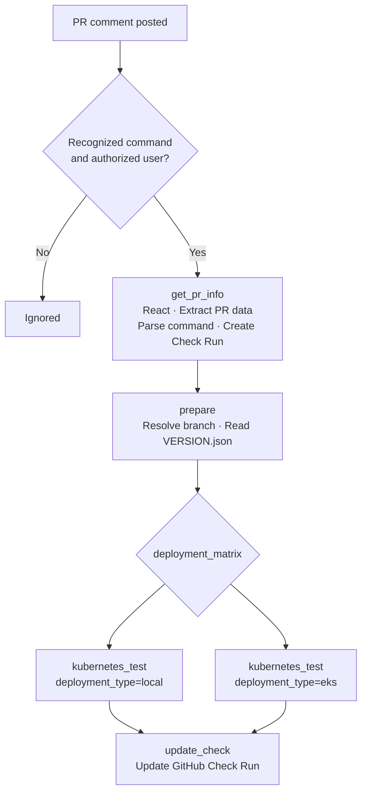
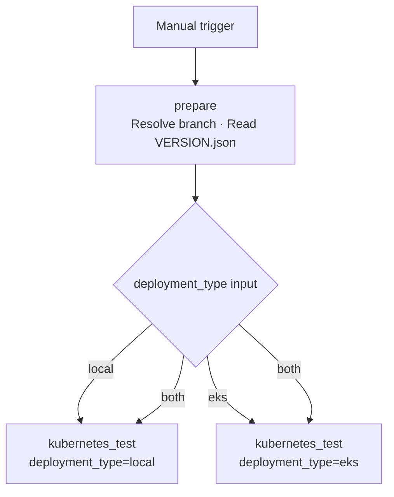

# Kubernetes Integration Tests

Workflow file: `.github/workflows/5_check_k8s_integration_tests.yaml`

This workflow provisions a Kubernetes cluster (Minikube or EKS), deploys Wazuh, and runs the integration test suite against the live deployment. It can be triggered manually or from a PR comment.

---

## Triggers

The workflow supports two execution modes:

| Mode | Trigger | Who can trigger |
|---|---|---|
| PR comment | `issue_comment` on an open PR | OWNER, MEMBER, or COLLABORATOR |
| Manual | `workflow_dispatch` | Anyone with repo write access |

---

## Execution Flows

### issue_comment flow

Triggered when an authorized user posts a recognized command on an open PR.



**Recognized commands:**

| Comment | Deployment matrix |
|---|---|
| `/test-k8s` | `["local"]` |
| `/test-k8s-local` | `["local"]` |
| `/test-k8s-eks` | `["eks"]` |

Only comments on **open** PRs from users with `OWNER`, `MEMBER`, or `COLLABORATOR` association are processed. All other comments are silently ignored.

### workflow_dispatch flow

Triggered manually. Skips `get_pr_info` and `update_check` (no Check Run is created).



---

## Parameters

### workflow_dispatch inputs

| Input | Required | Default | Description |
|---|---|---|---|
| `pr_head_ref` | Yes | — | Branch of `wazuh-kubernetes` to check out and test |
| `automation_reference` | No | `main` | Branch of `wazuh-automation` to install `test_runner` from |
| `deployment_type` | Yes | — | `local`, `eks`, or `both` |
| `version` | No | — | Override image version (e.g. `5.0.1`). If empty, reads from `VERSION.json` |
| `stage` | No | — | Image stage suffix (e.g. `beta1`, `beta2-latest`). Required when `version` is set manually |
| `registry` | No | `ECR` | `ECR` (dev images) or `DockerHub` (prod images) |

### issue_comment parameters

When triggered by a PR comment, all parameters are derived automatically:

| Parameter | Source |
|---|---|
| `pr_head_ref` | PR head branch from GitHub API |
| `pr_head_sha` | PR head SHA from GitHub API |
| `deployment_matrix` | Parsed from comment command |
| `version` / `stage` | Read from `VERSION.json` on the PR branch |
| `registry` | Defaults to ECR |
| `automation_reference` | Defaults to `main` |

---

## Image Tag Resolution

The effective image tag depends on which inputs are provided:

| `version` input | `stage` input | Registry | Resulting tag |
|---|---|---|---|
| empty | empty | ECR | `{VERSION.json version}{-stage}-latest` |
| empty | empty | DockerHub | `{VERSION.json version}{-stage}` |
| set | empty | ECR | `{version}-latest` |
| set | empty | DockerHub | `{version}` |
| set | set | ECR | `{version}-{stage}` |
| set | set | DockerHub | `{version}-{stage}` |
| empty | set | ECR | `{VERSION.json version}-{stage}` |
| empty | set | DockerHub | `{VERSION.json version}-{stage}` |

The effective `WAZUH_VERSION` (passed to `test_runner`) is always the version that ends up in the tag, whether it comes from `VERSION.json` or the `version` input.

---

## Job Details

### Job 1 — `get_pr_info` (issue_comment only)

| Step | What it does |
|---|---|
| React to comment | Adds a 🚀 reaction to the triggering PR comment |
| Extract PR data | Calls GitHub API to get PR `head_ref` and `head_sha` |
| Parse command | Maps comment text → `deployment_matrix` JSON and `check_name` string |
| Create Check Run | Creates a GitHub Check Run in `in_progress` state on the PR head SHA; passes the `check_run_id` to `update_check` |

### Job 2 — `prepare` (both triggers)

| Step | What it does |
|---|---|
| Resolve context | If `workflow_dispatch`: reads inputs. If `issue_comment`: reads outputs from `get_pr_info` |
| Checkout VERSION.json | Sparse-checks out only `VERSION.json` from the target branch |
| Read version info | Extracts `version` and `stage` fields from `VERSION.json` |
| Show test plan | Writes a summary table to the GitHub Actions step summary |

Outputs passed downstream: `pr_head_ref`, `deployment_matrix`, `wazuh_version`, `wazuh_stage`.

### Job 3 — `kubernetes_test` (matrix, both triggers)

Runs once per entry in `deployment_matrix`. Each instance provisions its own cluster.

#### Common setup

1. Checkout `wazuh-automation` at `automation_reference`
2. Checkout `wazuh-kubernetes` at `pr_head_ref`
3. Set up Python 3.12
4. Install `test_runner`:
   ```bash
   pip install -r wazuh-automation/deployability/deps/requirements.txt
   pip install -r wazuh-automation/integration-test-module/requirements.txt
   pip install -e wazuh-automation/integration-test-module/
   ```
5. Configure AWS credentials via OIDC (`AWS_IAM_ROLE`)
6. Resolve `WAZUH_VERSION`, `IMAGE_REGISTRY`, `IMAGE_TAG` (see [Image Tag Resolution](#image-tag-resolution))

#### Infrastructure provisioning

**Local (Minikube):**

| Step | Detail |
|---|---|
| Free disk space | Removes pre-installed tools to free ~20 GB; removes swap |
| Install Minikube | Downloads and installs latest `minikube-linux-amd64` |
| Start cluster | `minikube start --memory=8192 --cpus=4 --network-plugin=cni --cni=calico` |
| Login to ECR | Only if registry is ECR; authenticates Docker daemon |
| Pull + load images | Pulls `wazuh-dashboard`, `wazuh-indexer`, `wazuh-manager` and loads them into Minikube's internal registry |

**EKS:**

| Step | Detail |
|---|---|
| Install eksctl | Downloads latest `eksctl` binary |
| Create cluster | 6 managed spot nodes (`t3a.medium`), with OIDC; tagged with run metadata |
| EBS CSI driver | Creates IAM service account + installs `aws-ebs-csi-driver` addon |
| Network policies | Creates IAM SA for `aws-node`, enables `NetworkPolicy` support in VPC CNI |

#### Configuration and certificates

1. **Patch image references**: `yq` rewrites the image field in `dashboard-deploy.yaml`, `indexer-sts.yaml`, `wazuh-master-sts.yaml`, and `wazuh-worker-sts.yaml` to `${IMAGE_REGISTRY}/wazuh/<component>:${IMAGE_TAG}`
2. **Setup artifact URLs** (`setup_artifacts` composite action): downloads `artifact_urls.yaml` from S3, replaces template variables, exports `wazuh_certs_tool` and `wazuh_config_yml` as environment variables
3. **Download certs tool and config**: fetches `wazuh-certs-tool.sh` and `config.yml` from the S3 URLs
4. **Update `config.yml` for Kubernetes**: replaces IP-based node addressing with DNS names (cluster-internal service FQDNs)
5. **Generate certificates**: runs `tools/utils/deployment/certificates-conf.sh --cert --copy --priv`

#### Ingress configuration

**Local:**
- Patches `storage-class.yaml` to use `k8s.io/minikube-hostpath` provisioner
- Sets ingress match to `HostSNI(\`localhost\`)`
- Deploys Traefik CRD only (no Traefik runtime for Minikube)

**EKS:**
- Deploys Traefik CRDs and runtime (`kubectl apply -k traefik/runtime/`)
- Waits 5 minutes for the Traefik LoadBalancer to get a hostname
- Reads the LoadBalancer hostname and sets `HostSNI(\`{hostname}\`)` in the ingress route

#### Wazuh deployment

```bash
# EKS
kubectl apply -k envs/eks/

# Local
kubectl apply -k envs/local-env/
```

Waits up to **15 minutes** for all pods in the `wazuh` namespace to reach `Running` or `Completed` state, polling every 10 seconds.

Then waits up to **10 minutes** for:
- OpenSearch to report `"status"` in cluster health (requires 3 consecutive healthy responses)
- Dashboard to return HTTP 200/302 on `/app/status`

#### Test execution

```bash
test_runner \
  --test-type "kubernetes-${DEPLOY}" \
  --deployment-type "kubernetes-${DEPLOY}" \
  --use-local \
  --version "${WAZUH_VERSION}" \
  --log-level INFO \
  --output github \
  --output-file "test-results-k8s-${DEPLOY}.github"
```

| Argument | Value | Notes |
|---|---|---|
| `--test-type` | `kubernetes-local` or `kubernetes-eks` | Selects the test module set |
| `--deployment-type` | `kubernetes-local` or `kubernetes-eks` | Selects the deployment profile |
| `--use-local` | — | `kubectl` runs locally, not via SSH |
| `--version` | Resolved `WAZUH_VERSION` | Used for version assertion tests |
| `--output github` | — | Emits GitHub Actions annotations |
| `--output-file` | `test-results-k8s-{deploy}.github` | Saved for PR comment and artifact upload |

For details on what `kubernetes-local` and `kubernetes-eks` test types validate, see the `Integration Test Module — Description` of the internal documentation.

#### Reporting

| Output | When | Content |
|---|---|---|
| Step summary | Always | Test results appended to `$GITHUB_STEP_SUMMARY` |
| PR comment | `issue_comment` trigger only | Posts or updates a comment (identified by HTML marker `<!-- k8s-integration-check-{deploy} -->`) with ✅/❌ and the results file content |
| Artifact: `test-results-k8s-{deploy}-{run_id}` | Always | The `.github` results file, retained 7 days |
| Artifact: `k8s-logs-{deploy}-{run_id}` | On failure only | Full `kubectl` pod logs for all pods in `wazuh` namespace, retained 7 days |

#### EKS cleanup (always runs, even on failure)

```bash
eksctl delete cluster --name k8s-integration-test-{run_number}-eks --region {AWS_REGION}

# Delete any EBS volumes tagged with the cluster name
aws ec2 delete-volume --volume-id <id>
```

Minikube clusters are ephemeral — no explicit cleanup is needed for local deployments.

### Job 4 — `update_check` (issue_comment only)

Updates the GitHub Check Run created in Job 1 with the final conclusion:

| `kubernetes_test` result | Check conclusion |
|---|---|
| `success` | `success` — ✅ All Kubernetes integration tests passed |
| `failure` | `failure` — ❌ One or more tests failed |
| `cancelled` | `cancelled` |
| `skipped` | `skipped` |

---

## Required Secrets and Variables

### Secrets

| Secret | Used by |
|---|---|
| `AWS_ACCOUNT_ID` | ECR registry URL construction |
| `AWS_REGION` | All AWS operations |
| `AWS_IAM_ROLE` | OIDC role assumption for AWS credentials |
| `ARTIFACTS_S3_BUCKET` | Download `artifact_urls.yaml` |
| `GH_CLONE_TOKEN` | Checkout `wazuh-automation` (private repo) |
| `GITHUB_TOKEN` | PR comments and Check Run updates (built-in) |

### Repository variables

| Variable | Used by |
|---|---|
| `IMAGE_REGISTRY_PROD` | DockerHub registry URL |
| `IMAGE_REGISTRY_DEV` | ECR registry URL fallback label |
| `AWS_S3_BUCKET_DEV` | Artifact URL template expansion |

---

## Permissions

| Permission | Scope | Purpose |
|---|---|---|
| `id-token: write` | OIDC token | Authenticate to AWS via IAM role |
| `contents: read` | Repository | Checkout the PR branch |
| `pull-requests: write` | PR | Post/update PR comments |
| `issues: write` | Issues | Post comments (PR comments use the issues API) |
| `checks: write` | Checks | Create and update GitHub Check Runs |

---

## Cluster Naming

EKS clusters are named:

```
k8s-integration-test-{github.run_number}-{deployment_type}
```

Example: `k8s-integration-test-4217-eks`

This name is used for both cluster creation and deletion, and appears in resource tags for cost attribution.
